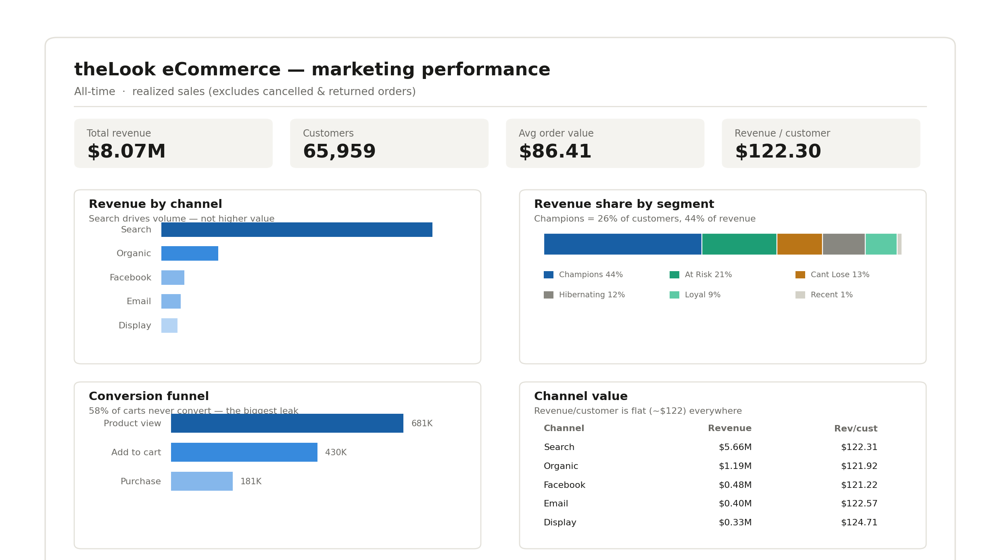

# theLook eCommerce — Marketing Analytics (BigQuery)

End-to-end marketing analytics project on Google BigQuery: from raw event and order data to an executive dashboard, covering funnel analysis, channel attribution, customer segmentation, cohort retention, and a predictive model — built entirely in SQL.



🔗 **[Live dashboard (Looker Studio)](ADD_YOUR_LINK_HERE)**

---

## Business questions

Playing the in-house marketing analyst for theLook, a global e-commerce apparel retailer, this project answers:

- Where in the customer journey are we losing the most people?
- Which acquisition channels bring the most *valuable* customers — not just the most customers?
- Who are our most valuable customers, and how do we target them?
- Do customers come back, and how fast does retention decay?
- Can we predict which customers will become high-value at the point of acquisition?

## Dataset & tools

- **Data:** `bigquery-public-data.thelook_ecommerce` — ~125K orders, ~80K customers, millions of web events
- **Warehouse / SQL:** Google BigQuery (CTEs, window functions, `NTILE`, statistical aggregates)
- **Machine learning:** BigQuery ML (logistic regression, `ML.EVALUATE`)
- **Visualization:** Looker Studio
- **Scope of analysis:** revenue counts only realized sales (`Complete`, `Shipped`, `Processing`); cancelled and returned orders (~25% of volume) are excluded.

## Key findings

**1. Cart abandonment is the biggest funnel leak.**
Of sessions that add an item to cart, **58% never complete the purchase** — a far larger drop-off than the 37% lost between product view and cart. Checkout, not traffic, is the highest-leverage conversion opportunity.

**2. Channel value is statistically flat — only volume differs.**
All five acquisition channels deliver near-identical per-customer value (~$122 revenue/customer, ~$86 AOV). A 95% confidence-interval comparison showed fully overlapping intervals, confirming the differences are not statistically significant. Search dominates total revenue purely on volume, not quality — so channel strategy should optimize for **acquisition cost**, not channel.

**3. Revenue is highly concentrated.**
"Champions" represent **26% of customers but 44% of revenue.** A further ~34% of revenue sits in "At Risk" and "Cant Lose Them" segments who haven't purchased in 1.5–3.7 years — a major win-back opportunity.

**4. The business is effectively one-and-done.**
Cohort analysis shows month-1 repeat-purchase rates of only **1–2%**, flat through month 6 and not improving across cohorts. Growth currently depends on new acquisition rather than repeat revenue.

**5. Customer value is not predictable at acquisition.**
A logistic regression model (BigQuery ML) predicting high-value customers from channel + demographics scored an **AUC of 0.52 — essentially no better than chance.** Rather than a failure, this is the finding: value here isn't predictable from *who* customers are or *how* they're acquired — it's created *after* acquisition, through retention.

## Recommendation

The findings converge on one strategic message: **theLook cannot acquire or predict its way to high-value customers — value is built post-acquisition.** Priorities, in order:

1. **Fix checkout** — recover abandoned carts (email/retargeting, simplified checkout, trust signals). Biggest immediate revenue lever.
2. **Win back lapsed high-spenders** — targeted reactivation for "At Risk" and "Cant Lose Them" (34% of revenue at risk).
3. **Reallocate spend to lowest-cost channels** — since value is flat, lean into Email/Organic where acquisition is cheaper.
4. **Drive the second purchase** — onboarding and first-repeat incentives, given near-zero baseline retention.

## Methodology

| Phase | Focus | Technique |
|-------|-------|-----------|
| 1 | Data profiling & quality | Grain analysis, null checks, business-rule definition |
| 2 | Conversion funnel | Session-level funnel with conditional aggregation |
| 3 | Channel performance | Per-customer value + 95% confidence-interval test |
| 4 | RFM segmentation | `NTILE` scoring, named segments |
| 5 | Cohort retention | Monthly cohorts, retention decay matrix |
| 6 | Predictive modeling | BigQuery ML logistic regression + evaluation |
| 7 | Dashboard | Looker Studio reporting layer |

## Repository structure

```
├── README.md
├── sql/                    # All analysis queries, one per phase
├── dashboard/              # Dashboard screenshot
└── insights/               # One-page insights memo
```

## Notes on the data

theLook is a synthetic dataset, so some metrics (e.g. a 26% overall conversion rate, near-flat retention) are artifacts of how the data is generated rather than real-world behavior. Where relevant, findings are framed against real-world benchmarks (e.g. 2–3% typical e-commerce conversion, 20–30% month-1 retention) to demonstrate the right interpretation.
